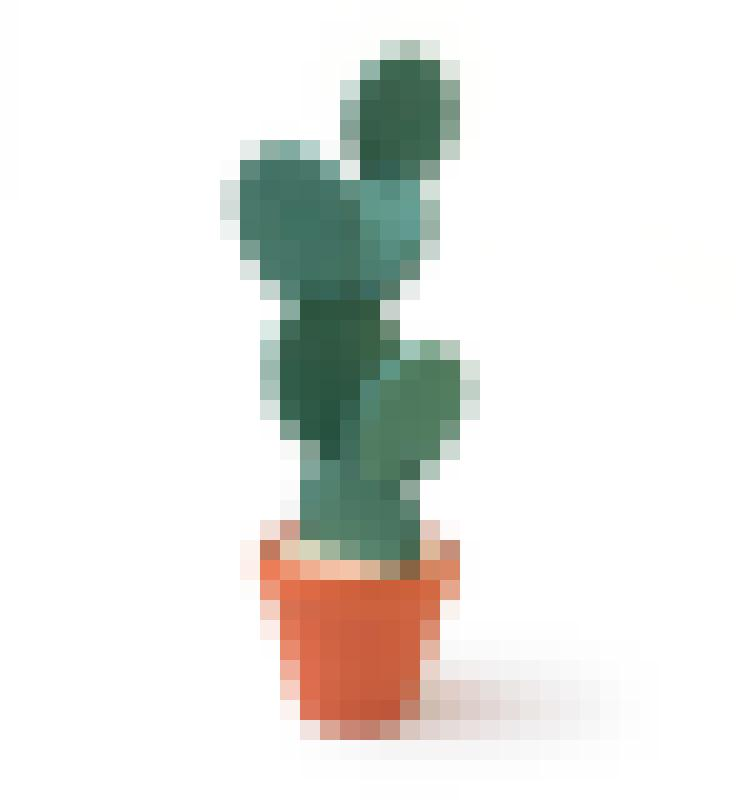
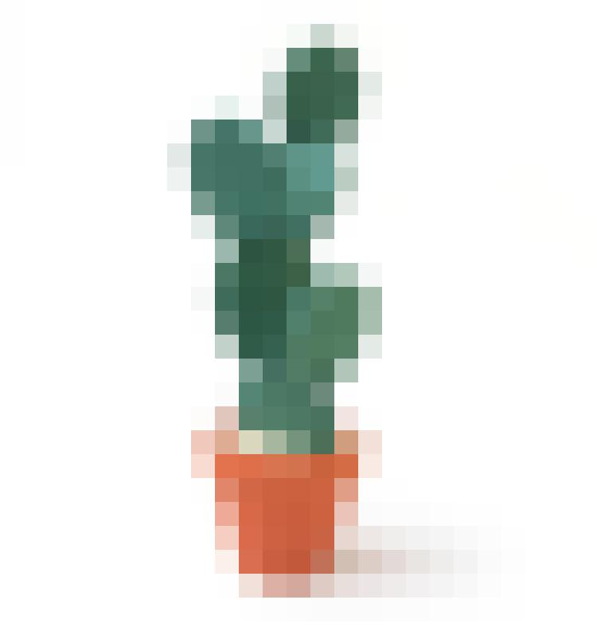

##Image editing in Python

This project started with two ideas for an image effect that I haven't seen yet. I want to take an image, split it into a grid of pixels and replace grid cells with different objects.

The object I want to replace the grid cells with is a circle. I will reduce each grid cell/square to greyscale and depending on how dark it is, replace it with a donut shape. The brighter the grid cell/square, the more filled in it will be. The more lightest square will just be a thin circle.

The splitting of the image into squares is the first step, so to do this I made a script that turns an image into a mosaic.

###Installing

I'll always recommend using a [virtualenv](http://docs.python-guide.org/en/latest/dev/virtualenvs/). 

The best way to install the dependencies for this program is to run
	
	pip install -r requirements.txt

###Usage

I've tested this program with ```.jpg``` files, which have RGB values. ```.gif``` files do not so those won't work.

To run this, use the following commands -

	python run_application.py <original_file_name> <option> <square_width>

```<original_file_name>``` - this should be in the ```/images``` folder. The images folder is also where the resulting images are saved.

```<option>``` - this is the process that you want to apply to the image. At the moment, ```mosaic``` is the only one available.

```<square_width>``` - the size of the resulting squares.

###Use examples

This is the original image, 750 wide, 807 high


These are valid inputs from the terminal and the images that would result.

	python run_application.py original.jpg mosaic 10


	python run_application.py original.jpg mosaic 20



	python run_application.py original.jpg mosaic 30

