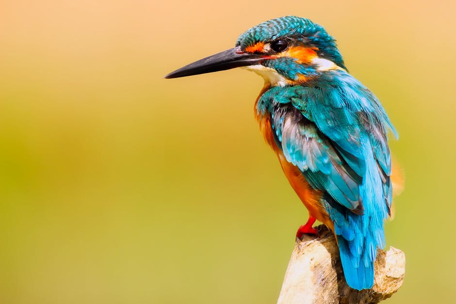

## Image editing in Python

This project started with two ideas for an image effect that I haven't seen yet. I want to take an image, split it into a grid of pixels and replace grid cells with different objects.

Now, this is simply a place where I will keep image editing scripts so that they can share code etc.

### Installing

I'll always recommend using a [virtualenv](http://docs.python-guide.org/en/latest/dev/virtualenvs/). 

The best way to install the dependencies for this program is to run
	
	pip3 install -r requirements.txt

### Usage

The project has a few executable programs in the top directory. Those include:

    ./run_project <file> mosaic 40 # Makes mosaic with tiles 40 pixels in width
    ./make_simple <file> 4 3 2 # reduces the range of colours to 4 red, 3 green and 2 blue
    blue

I've tested these programs with ```.jpg``` files, which have RGB values. ```.gif``` files do not so those won't work.

### Use examples

#### Mosaic

Original


	./run_application.py original.jpg mosaic 10


	./run_application.py original.jpg mosaic 30


#### Make simple

Original


    
    ./make_simple.py pexels-photo-326900.jpeg 2 5 2


