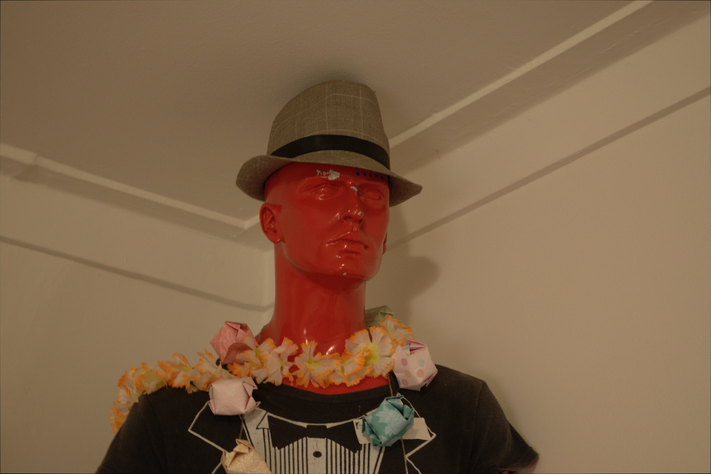

#### Outlines

Original - note this is an original RAW file from a Nikon d90. All other pics here have been
converted to JPEG after processing to display here, because the actual files are too large.

You don't want to use JPEG for this process, because the JPEG algorithm is lossy and won't be
detailed enough to convert.

    ufraw-batch --output=images/FILE_geeves.tiff --out-type=tiff images/DSC_0110.NEF

    ./make_simple.py images/FILE_geeves.tiff 4 4 4

    ./outlines.py images/make_simple_4_4_4_FILE_geeves.tiff

